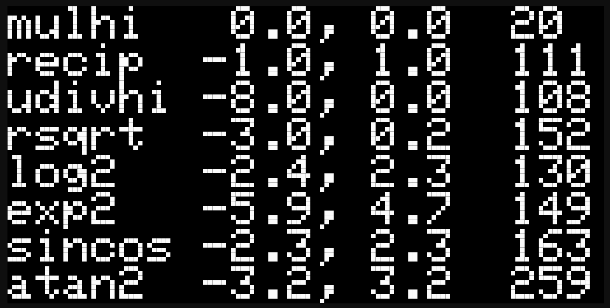
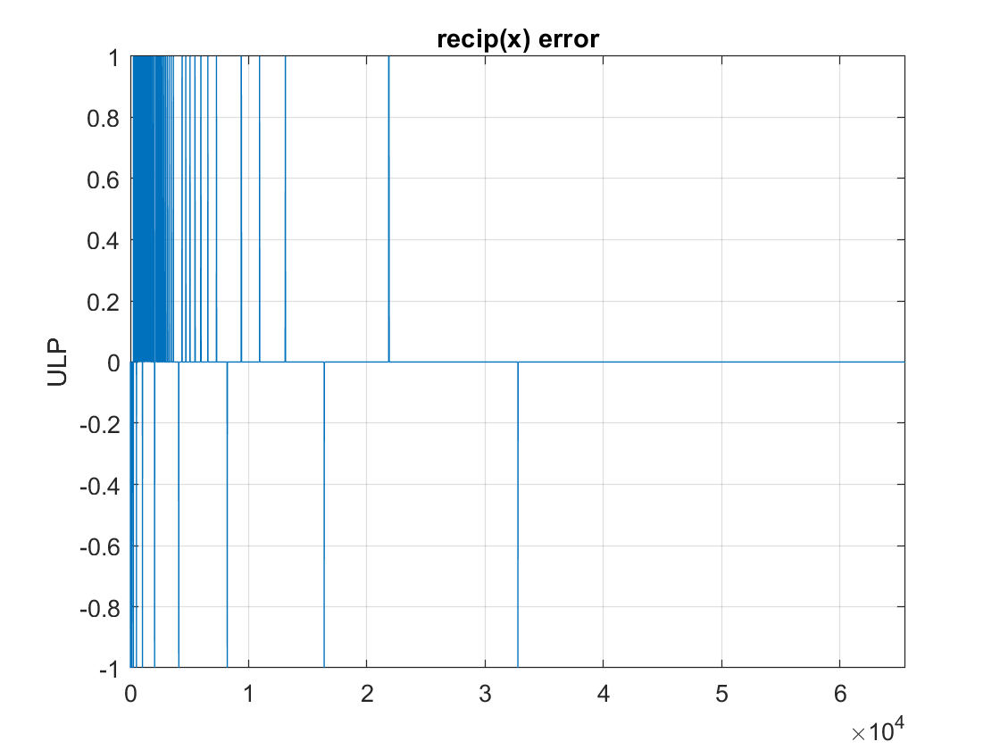
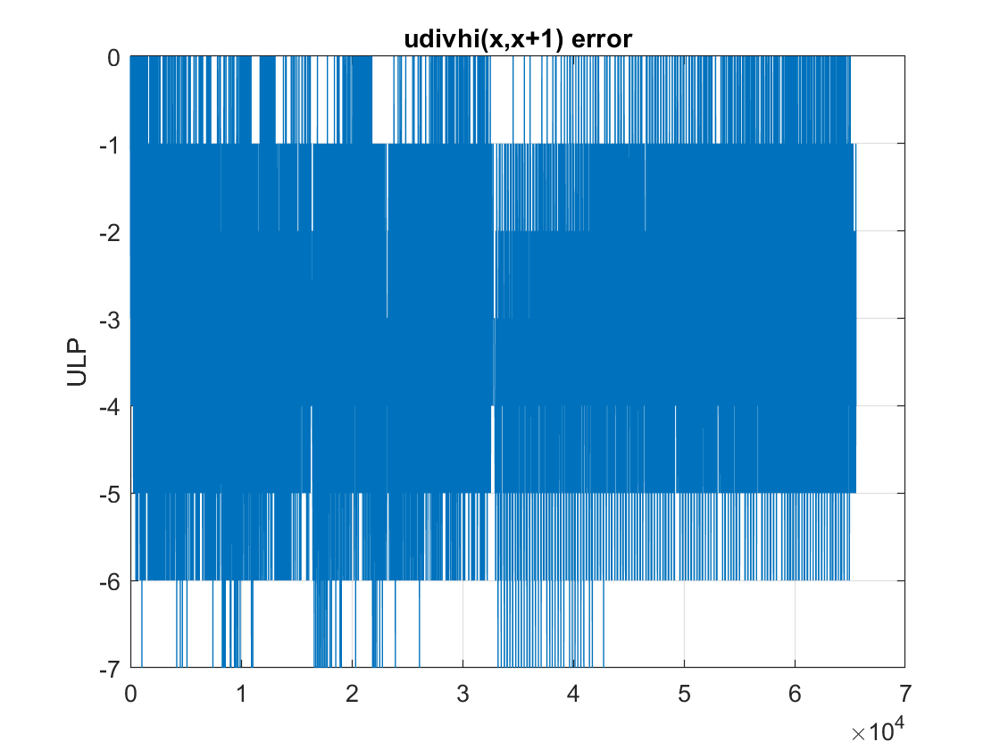
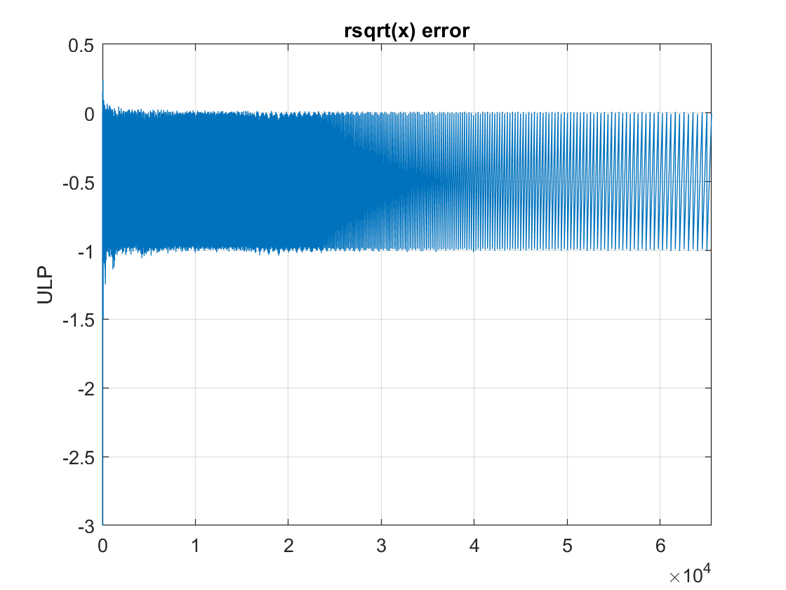
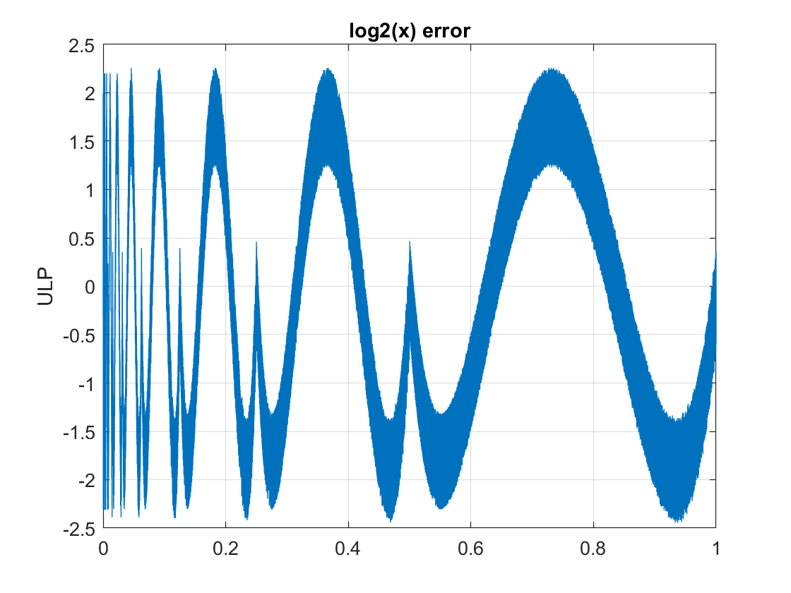
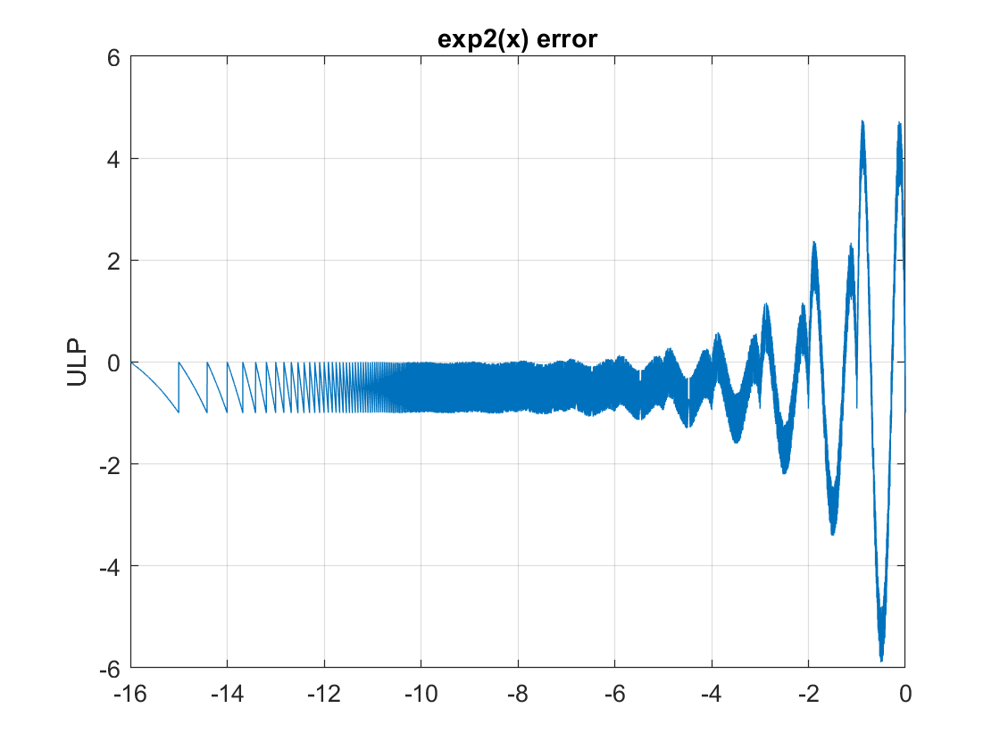
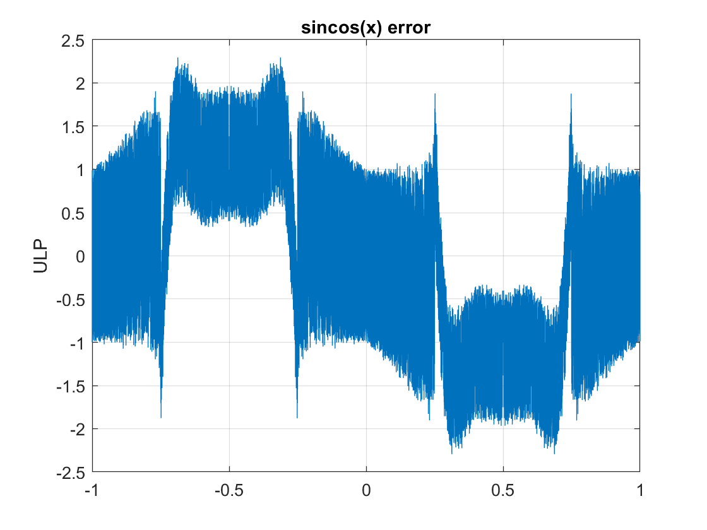
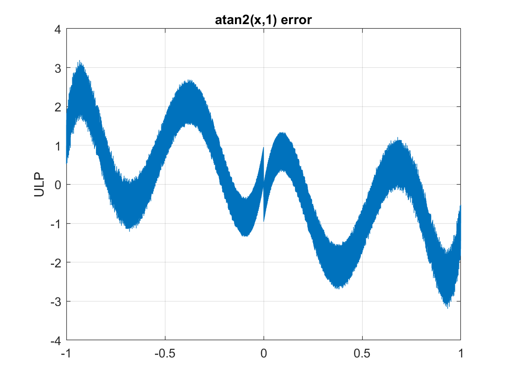

# AVR-fixpt-math
A small/fast 16-bit fixed-point math library, optimized for 8-bit AVR/Arduboy.  
The header-only library is in [fixpt.h](src/fixpt.h).  
The Arduboy test/benchmark app is in [main.cpp](src/main.cpp).

It implements these fixed-point functions:  
MULHI, UMULHI, norm, recip, udivhi, rsqrt, log2, exp2, sincos, atan2

All math functions have been exhaustively tested over their argument domains.

For sin/cos/atan2, angles represent multiples of pi, rather than radians.  
This allows phase wrapping for free and special values to be exact.

#
Min/max error (ULP) and typical performance (clock cycles) measured on ATmega32U4.  
Due to lack of hardware barrel shifter, performance varies with magnitude of inputs.

#
Error plots (ULP) for each function:

